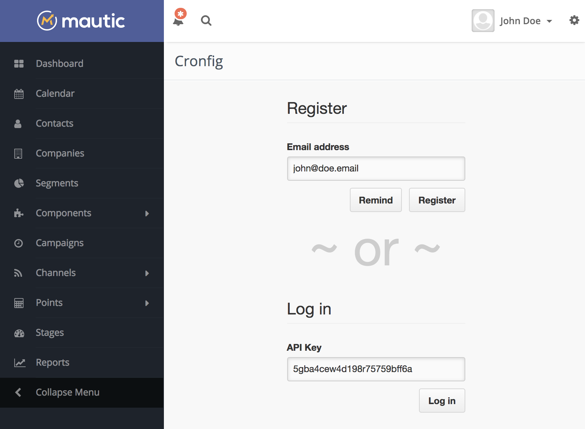

Cronfig is a micro service living in other server than yours. You have to create an account in the service so the service knows it's you who is viewing/creaing/modifying your tasks. The account is as minimal as it can be. All you need is an email address. That's it. Here is how the workflow of creating a new account looks like:

1. [Install](/basics/installation) the plugin into your system (Mautic probably).
2. The first page you'll see is **register**/remind/login page (screenshot bellow).
3. Use the pre-filled **email address** to register a new account or fill in another one, hit submit.
4. You'll receive an email with your **API key** and account delete link (documented bellow)
5. Fill in your API key to the login field, hit submit.
6. While logged in, create the jobs you need and/or see how the past jobs are doing.

The system you've installed Cronfig plugin into will remember the API key for you. No need to search for the registration email every time.

## Account limits

After you log in you may notice the information about all the limits your account have. The purpose of the limits is that one account won't take all server resources for itself at the expense of other accounts. 

## Upgrade your account

If you need Cronfig to work harder for you, please take a look at the [paid plans](https://cronfig.io) and consider if you could chip in on the project maintanance.

The proces is little bit cumbersome thanks to EU laws. Here is how it currently looks like:

1. Submit the [order form](https://cronfig.io/order.html).
2. I'll manually craft a pro forma invoice for you and add the VAT based on your country and TAX ID (if any) and send it to your email.
3. You'll be able to pay with a PayPal button directly on the invoice or via bank transfer.
4. After you pay, I'll manually upgrade your account.

You probably noticed that there is some manual work involved. I'm processing the orders ASAP, but it may happend that I'm out of keyboard. I plan to automate the process but it's at the bottom of Cronfig's road map. I have cooler things to implement for this service.

## Delete your account

The Cronfig service intention is NOT to get your personal information. As you could notice, all it needs is your email address so it can contact you when your system is having troubles processing the jobs. But if you are not interested in using Cronfig anymore, there is a link in your **registration email** which will delete your account, your jobs, your logs from Cronfig.

How can you be sure it does that? Apart from that you won't be able to log in with your API key anymore and your tasks will stop being executed, you can try to register again. It will let you. That's the trick. It won't let you if an account with the same email address exists. Only if it does not.