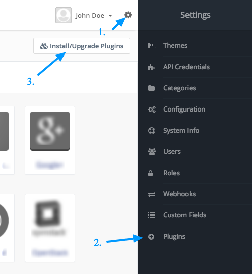
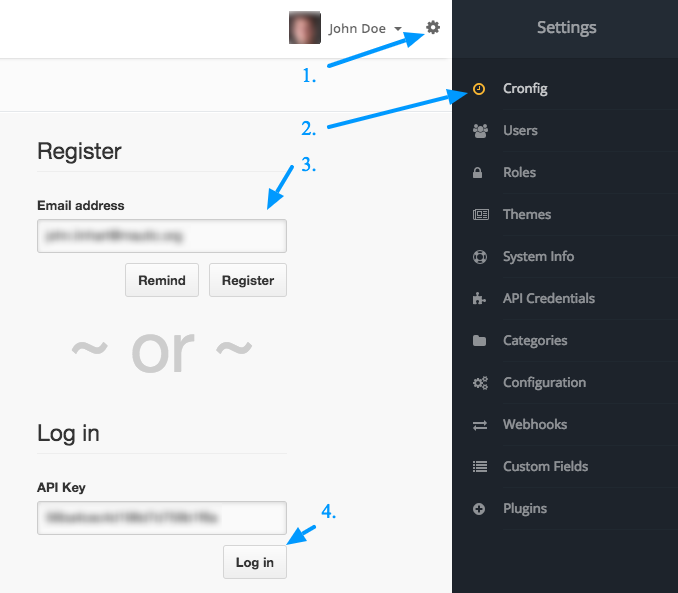

## Installation

### Place the files of the plugin into your Mautic

There are 2 ways to get the Mautic-Cronfig plugin to your Mautic. If you have SSH access to your server or if you have only SFTP access. Follow the steps based on what you have.

#### I have SSH access

1. Log in with `ssh user@host`
2. Go to your Mautic root folder and then to the plugins folder. `cd /path_to_mautic/plugins`
3. Download the zip package of the plugin and name it cronfig.zip. `curl https://github.com/cronfig/mautic-cronfig/archive/master.zip -o cronfig.zip -L` (`wget` can be used instead of `curl`)
4. Unzip the content of the zip file to the _CronfigBundle_ folder. `unzip cronfig.zip -d CronfigBundle`
5. Rename the folder from `mautic-cronfig` to `CronfigBundle`. `mv mautic-cronfig CronfigBundle`
6. Clear Mautic's cache. Simply delete the content of `app/cache/prod` folder. `rm -rf ../app/cache/prod/*`

#### I have only SFTP access

1. [Download](https://cronfig.mautic.net/asset/1:mautic-cronfig-plugin) the plugin to your computer.
2. Unzip the downloaded package.
3. Upload the unzipped folder to the plugins folder.
4. Rename it to CronfigBundle the way so you could locate CronfigBundle.php file on this path: `plugins/CronfigBundle/CronfigBundle.php`.
5. Clear Mautic's cache. Simply delete the content of `app/cache/prod` folder.

### Enable Cronfig Plugin in Mautic

6. Go to the right hand side Mautic menu (click the cog icon in the top right corner to slide the menu out) and go to Plugins.
7. Click the Install/Upgrade Plugins button. The Cronfig icon should appear in the list of plugins.

8. Go to the right hand side Mautic menu again. A new menu item called Cronfig should be there. Hit it. A register/login screen should appear.
9. Your email should be prefilled. Click on the Register button and check your email inbox. Your API key should appear in your inbox any second.
10. If you received the Cronfig registration email, copy the API key from it, insert it to the Log in input and log in.
